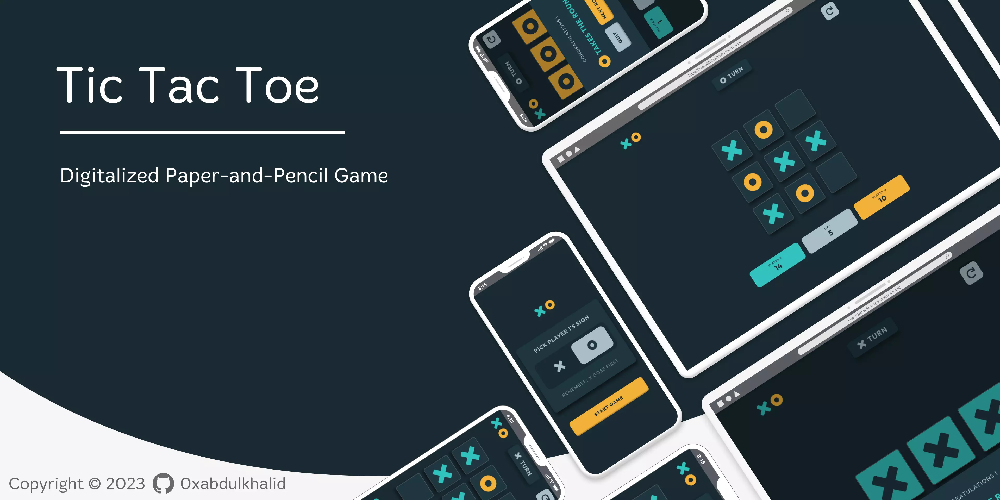
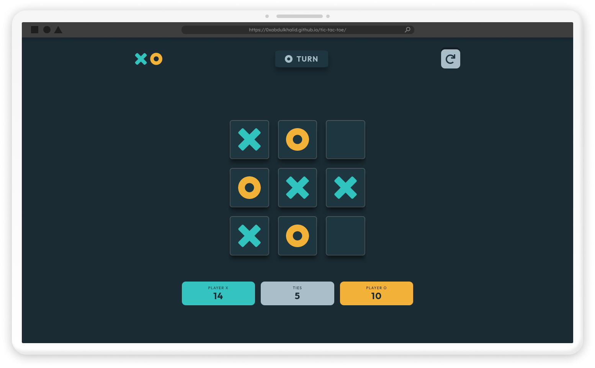
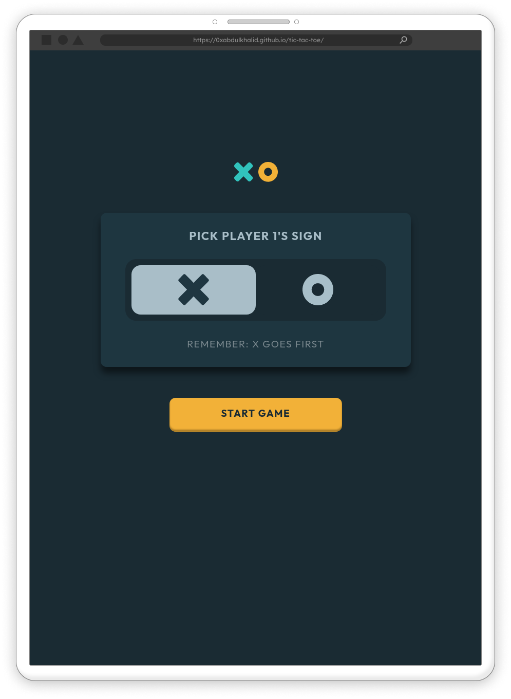
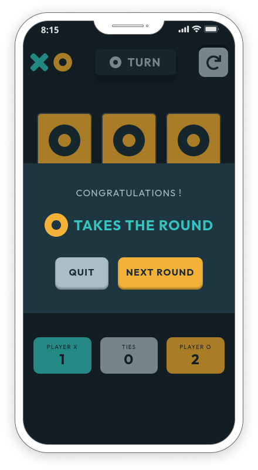

## **Description**

- The purpose of the project was to use the Module pattern and the Factory Pattern to build and design objects to incorporate game logic
- The Game offers a Player vs Player game mode

## **Preview**

|                            Desktop                             |
| :------------------------------------------------------------: |
|  |

|                                   Tablet                                   |                            Mobile                            |
| :------------------------------------------------------------------------: | :----------------------------------------------------------: |
|  |  |

 

## **Outcome**

- Game logic is built with **Module pattern** and **Factory Functions**
- Efficiently used **data** attributes to manipulate dom elements
- Well optimized **UI** and **UX**
- Site was built responsive via **Mobile first workflow**
- **Cross tested** on Firefox and Chromium based browsers

 

## **What I learned**

- Usage of **data-** attribute which provides the ability to embed custom data on all elements which will be used to further manipulate game logic
- Usage of **module pattern** to improve the maintainability and reusability of the code by creating public and private access levels
- Learned the Logic behind the Tic tac toe game
- A lot of minor things

 

## **Built With**

- 
- 
- 

 

## **Tools Used**

- 
- 
- 
"# tic-tac-toe-main" 
